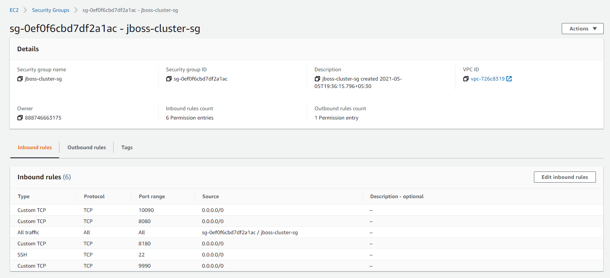

# Jboss EAP Cluster :

- https://access.redhat.com/documentation/en-us/red_hat_jboss_enterprise_application_platform/7.2/html/deploying_jboss_eap_on_amazon_web_services/index

```sh
---------------------------------------------
# SSH Connect (Client):

$ sudo ssh -i "jboss-cluster.pem" -o StrictHostKeyChecking=no -o UserKnownHostsFile=/dev/null ec2-user@13.232.247.113

$ sudo scp -i "jboss-cluster.pem" -o StrictHostKeyChecking=no -o UserKnownHostsFile=/dev/null development.war ec2-user@13.232.247.113:

# How to exit an SSH connection if the shell is unresponsive:

Hit the Enter key, then type ~.

---------------------------------------------
# EC2 Instance (Server):

- OS: Red Hat Enterprise Linux 8 (HVM), SSD Volume Type - ami-0a9d27a9f4f5c0efc (64-bit x86)
- Instance Type: "t2.small" 
- Network: vpc-default(mumbai - ap-south-1)
- Subnet: subnet-default(ap-south-1a)
- Security Group: "jboss-cluster-sg"

[ec2-user@ip-172-31-46-240 ~]$ cat /etc/system-release # /etc/os-release
Red Hat Enterprise Linux release 8.3 (Ootpa)

# List all Users:

$ cat /etc/hosts
127.0.0.1   localhost localhost.localdomain localhost4 localhost4.localdomain4
::1         localhost localhost.localdomain localhost6 localhost6.localdomain6

$ hostname
ip-172-31-32-10.ap-south-1.compute.internal
$ hostname -I
172.31.32.10

$ ip addr show
::::::::
2: eth0: <BROADCAST,MULTICAST,UP,LOWER_UP> mtu 9001 qdisc fq_codel state UP group default qlen 1000
    link/ether 02:d9:ca:2e:01:74 brd ff:ff:ff:ff:ff:ff
    inet 172.31.32.10/20 brd 172.31.47.255 scope global dynamic noprefixroute eth0
::::::::

# List all Users:

$ cat /etc/passwd
$ awk -F: '{ print $1}' /etc/passwd
$ cut -d: -f1 /etc/passwd
root:x:0:0:root:/root:/bin/bash
:::::::::
ec2-user:x:1000:1000:Cloud User:/home/ec2-user:/bin/bash

---------------------------------------------
# Startup scripts:

#!/bin/bash
# sudo yum update -y
sudo yum install -y java-1.8.0-openjdk.x86_64
sudo yum install -y wget
sudo yum install -y zip
sudo yum install -y psmisc # killall
sudo yum install -y nano

sudo yum install -y firewalld
sudo systemctl start firewalld
sudo systemctl enable firewalld
sudo systemctl status firewalld
# sudo firewall-cmd --list-all
# sudo firewall-cmd --zone=public --add-port=5000/tcp --permanent # open a port
# sudo firewall-cmd --reload
# sudo firewall-cmd --zone=public --remove-port=5000/tcp --permanent # block a port
# sudo firewall-cmd --reload

---------------------------------------------
# Download Jboss-eap-7.2.0

$ wget https://access.cdn.redhat.com/content/origin/files/sha256/65/657cbd07aa87dcf4dc4d8ceb0cdd6e4414a156a75cf14ce2b2a79ade36463482/jboss-eap-7.2.0.zip?_auth_=1620459063_1e13a19aadff0bc2b1f6dfa071a93c75

$ wget https://access.redhat.com/cspdownload/c30184eb7e7b50a08dc651d25910ec0a/60b47b15/JBEAP-7.2.0/jboss-eap-7.2.0.zip

$ unzip jboss-eap-7.2.0.zip* -d .
# $ rm jboss-eap-7.2.0.zip*

# Create admin-user:

$ ./add-user.sh rama Rama123$
Added user 'rama' to file '/home/ec2-user/jboss-eap-7.2/standalone/configuration/mgmt-users.properties'
Added user 'rama' to file '/home/ec2-user/jboss-eap-7.2/domain/configuration/mgmt-users.properties'

# After adding "ec2-standalone-full-ha.xml" profile to "jboss-eap-7.2/standalone/configuration":

$ cp -rf jboss-eap-7.2/ jboss-eap-7.2-test1/
$ cp -rf jboss-eap-7.2/ jboss-eap-7.2-test2/

# Add exceptions:

$ sudo firewall-cmd --list-all
public (active)
  target: default
  icmp-block-inversion: no
  interfaces: eth0
  sources:
  services: cockpit dhcpv6-client ssh
  ports:
  protocols:
  masquerade: no
  forward-ports:
  source-ports:
  icmp-blocks:
  rich rules:
# open up server1 ports:
$ sudo firewall-cmd --zone=public --add-port=9990/tcp --permanent
$ sudo firewall-cmd --zone=public --add-port=8080/tcp --permanent
$ sudo firewall-cmd --add-port=7600/tcp --permanent
# open up server2 ports:
$ sudo firewall-cmd --zone=public --add-port=10090/tcp --permanent
$ sudo firewall-cmd --zone=public --add-port=8180/tcp --permanent
$ sudo firewall-cmd --add-port=7600/tcp --permanent

$ sudo firewall-cmd --reload
$ sudo firewall-cmd --list-all
public (active)
::::::::
  ports: 9990/tcp 10090/tcp 8080/tcp 8180/tcp 7600/tcp
::::::::

---------------------------------------------------
# Same Machine (Vertical Cluster):

# Server 1:

$ ./standalone.sh \
    --server-config=ec2-standalone-full-ha.xml \
    -Djboss.bind.address=`hostname -I` \
    -Djboss.bind.address.management=`hostname -I` \
    -Djboss.bind.address.private=`hostname -I` \
    -Djboss.bind.address.unsecure=`hostname -I` \
    -Djboss.server.name=Server1-`hostname -I` \
    -Djboss.node.name=Node1-`hostname -I` \
    -Djboss.tx.node.id=TxNode1-`hostname -I` \
    -Dcustom.jboss.jgroups.tcp.initial_hosts=172.31.32.10[7600],172.31.32.10[7700] \
    -Dcustom.jboss.jgroups.tcp.password=Wxyz1234 \
    -Djboss.messaging.cluster.password=Abcd1234

# Server 2:

$ ./standalone.sh \
    --server-config=ec2-standalone-full-ha.xml \
    -Djboss.bind.address=`hostname -I` \
    -Djboss.bind.address.management=`hostname -I` \
    -Djboss.bind.address.private=`hostname -I` \
    -Djboss.bind.address.unsecure=`hostname -I` \
    -Djboss.server.name=Server2-`hostname -I` \
    -Djboss.node.name=Node2-`hostname -I` \
    -Djboss.tx.node.id=TxNode2-`hostname -I` \
    -Dcustom.jboss.jgroups.tcp.initial_hosts=172.31.32.10[7600],172.31.32.10[7700] \
    -Dcustom.jboss.jgroups.tcp.password=Wxyz1234 \
    -Djboss.messaging.cluster.password=Abcd1234 \
    -Djboss.socket.binding.port-offset=100

$ sudo netstat -tlnup | grep LISTEN | grep java
tcp        0      0 127.0.0.1:9990          0.0.0.0:*               LISTEN      1493/java
tcp        0      0 127.0.0.1:3528          0.0.0.0:*               LISTEN      1493/java
tcp        0      0 127.0.0.1:8009          0.0.0.0:*               LISTEN      1493/java
tcp        0      0 127.0.0.1:7600          0.0.0.0:*               LISTEN      1493/java
tcp        0      0 127.0.0.1:8080          0.0.0.0:*               LISTEN      1493/java
tcp        0      0 127.0.0.1:8443          0.0.0.0:*               LISTEN      1493/java
tcp        0      0 127.0.0.1:45185         0.0.0.0:*               LISTEN      1493/java
::::::::

$ sudo killall -9 java

---------------------------------------------------
# Different Machines (Horizontal Cluster):

# Server 1:

[ec2-user@ip-172-31-46-240]$ hostname
ip-172-31-46-240.ap-south-1.compute.internal
[ec2-user@ip-172-31-46-240]$ hostname -I
172.31.32.10

$ ./standalone.sh \
    --server-config=ec2-standalone-full-ha.xml \
    -Djboss.bind.address=`hostname -I` \
    -Djboss.bind.address.management=`hostname -I` \
    -Djboss.bind.address.private=`hostname -I` \
    -Djboss.bind.address.unsecure=`hostname -I` \
    -Djboss.server.name=Server-`hostname -I` \
    -Djboss.node.name=Node-`hostname -I` \
    -Djboss.tx.node.id=TxNode-`hostname -I` \
    -Dcustom.jboss.jgroups.tcp.initial_hosts=172.31.32.10[7600],172.31.32.11[7600] \
    -Dcustom.jboss.jgroups.tcp.password=Wxyz1234 \
    -Djboss.messaging.cluster.password=Abcd1234

# Server 2:

[ec2-user@ip-172-31-43-234]$ hostname
ip-172-31-43-234.ap-south-1.compute.internal
[ec2-user@ip-172-31-43-234]$ hostname -I
172.31.32.11

$ ./standalone.sh \
    --server-config=ec2-standalone-full-ha.xml \
    -Djboss.bind.address=`hostname -I` \
    -Djboss.bind.address.management=`hostname -I` \
    -Djboss.bind.address.private=`hostname -I` \
    -Djboss.bind.address.unsecure=`hostname -I` \
    -Djboss.server.name=Server-`hostname -I` \
    -Djboss.node.name=Node-`hostname -I` \
    -Djboss.tx.node.id=TxNode-`hostname -I` \
    -Dcustom.jboss.jgroups.tcp.initial_hosts=172.31.32.10[7600],172.31.32.11[7600] \
    -Dcustom.jboss.jgroups.tcp.password=Wxyz1234 \
    -Djboss.messaging.cluster.password=Abcd1234

---------------------------------------------------
# Start Jboss EAP as a Service:

$ sudo cp jboss-eap-7.2/bin/init.d/jbosseap7.service /etc/systemd/system

$ sudo systemctl daemon-reload # Reload the service files to include the new service

$ sudo systemctl start jbosseap7

$ sudo systemctl status jbosseap7

$ sudo systemctl enable jbosseap7 # To enable the service on every reboot
Created symlink from /etc/systemd/system/multi-user.target.wants/jbosseap7.service to /etc/systemd/system/jbosseap7.service.

```

# Security Group Configuration :

